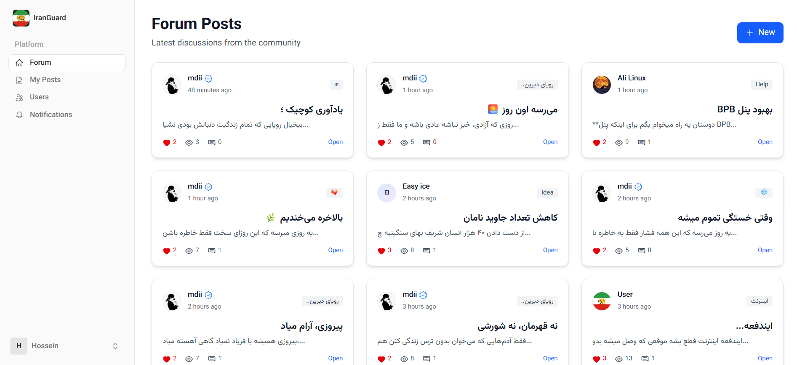

# IranGuard Forum   

[](./LICENSE)
[](https://laravel.com)
[](https://livewire.laravel.com)
[](https://vite.dev)
[](https://tailwindcss.com)
[](https://www.php.net)

Freedom community forum for Iran — built on Laravel + Livewire + Vite and Tailwind, with a focus on simplicity and privacy.



## Features
- User registration, login, email verification, 2FA
- Create posts, comments, likes, views tracking
- Notifications and user profiles with image upload
- Modern frontend built with Vite and Tailwind CSS

## License
- GPL-3.0 — see the full text in [LICENSE](./LICENSE).

## Prerequisites
- PHP 8.2+ and Composer
- Node.js 18+ and npm
- Database: SQLite by default; MySQL recommended for production

## Install

- Clone repository:

```bash
git clone https://github.com/frank-vpl/Forum.git
```

- Go to project directory:

```bash
cd Forum
```

- Install PHP packages:

```bash
composer install
```

If install has issues, you can use:

```bash
composer update
```

- Install JavaScript packages:

```bash
npm install
```

- Create environment file:

```bash
cp .env.example .env
```

On Windows (PowerShell):

```bash
copy .env.example .env
```

Helpful: APP_NAME supports quotes when the name has spaces.

- Generate application key (sets APP_KEY in .env):

```bash
php artisan key:generate
```

### Configure .env
Set each variable with short tips. See DB and Email “code cards” followed by helpful lists.

- App name (quotes allowed if spaces):

```bash
APP_NAME="IranGuard Forum"
```

- Environment:

```bash
APP_ENV=local
```

- Debug (set to false in production):

```bash
APP_DEBUG=true
```

- App URL (port/domain/subdomain supported):

```bash
APP_URL=http://localhost
```

#### Database Settings (MySQL example)

```dotenv
DB_CONNECTION=mysql
DB_HOST=127.0.0.1
DB_PORT=3306
DB_DATABASE=iranguard_forum
DB_USERNAME=root
DB_PASSWORD=
```

- DB_CONNECTION: mysql recommended for production; sqlite works out-of-the-box.
- DB_HOST: your database server host; use service name if using Docker.
- DB_PORT: default MySQL port is 3306; adjust if your provider differs.
- DB_DATABASE: database name; create it before running migrations.
- DB_USERNAME: MySQL user with permissions on the database.
- DB_PASSWORD: user password; for local root it may be empty.

#### Email Settings (SMTP example)

```dotenv
MAIL_MAILER=smtp
MAIL_SCHEME=null
MAIL_HOST=smtp.example.com
MAIL_PORT=465
MAIL_USERNAME=your_email@example.com
MAIL_PASSWORD=your_email_password
MAIL_FROM_ADDRESS=your_email@example.com
MAIL_FROM_NAME="${APP_NAME}"
MAIL_ENCRYPTION=ssl
```

- MAIL_MAILER: driver (smtp recommended for providers).
- MAIL_SCHEME: leave null unless your provider requires a scheme.
- MAIL_HOST: SMTP server host from your email provider.
- MAIL_PORT: 465 for SSL, 587 for TLS (common defaults).
- MAIL_USERNAME: mailbox username or full email address.
- MAIL_PASSWORD: mailbox password or app-specific password.
- MAIL_FROM_ADDRESS: sender address shown in emails.
- MAIL_FROM_NAME: display name; typically your app name.
- MAIL_ENCRYPTION: ssl or tls per provider requirements.

### Database
- SQLite works out of the box. For MySQL, remove comments (`#`) from the DB variables above and fill in your credentials.
- Then run migrations:

```bash
php artisan migrate
```

### Build and Run
- Build frontend assets (Vite):

```bash
npm run build
```

- Link storage (exposes public/storage for uploads):

```bash
php artisan storage:link
```

- Run local development server (dev only):

```bash
php artisan serve
```

### Production
- Do not use `php artisan serve` in production. Point your web server’s document root to the `public/` directory.
- If your host requires `.htaccess` in project root to redirect to `public/`, add:

```apache
<IfModule mod_rewrite.c>
    RewriteEngine On
    # Redirect all requests to public folder
    RewriteCond %{REQUEST_URI} !^/public/
    RewriteRule ^(.*)$ public/$1 [L]
</IfModule>
```

## Shared Hosting (no shell/SSH)
- Install and build locally:
  - Follow Install steps above
  - Run `npm run build`
- Zip project files (exclude `node_modules`)
- Upload to shared hosting and extract
- Ensure web root points to `public/` (or use the `.htaccess` redirect shown above)
- Open your website URL

## Built With
- Laravel 12, Livewire 4
- Vite 7, Tailwind CSS 4

## Development Scripts
- Run everything together (server, queue, Vite): `composer run dev`
- Lint PHP code: `composer run lint`
- Run tests: `composer run test`

## Security Notes
- Do not commit real credentials or secrets. Keep `.env` out of version control.
- Review mail and storage settings before deploying to production.

---

<div align="center">
  <br />
  
  <strong>Made with ❤️ by Hossein Pira</strong>
  <br />
  <a href="https://t.me/h3dev">Telegram</a>
  &nbsp;•&nbsp;
  <a href="mailto:h3dev.pira@gmail.com">Email</a>
  &nbsp;•&nbsp;
  <a href="https://instagram.com/h3dev.pira">Instagram</a>
  &nbsp;•&nbsp;
  <a href="https://x.com/albert_com32388">X (Twitter)</a>
</div>
